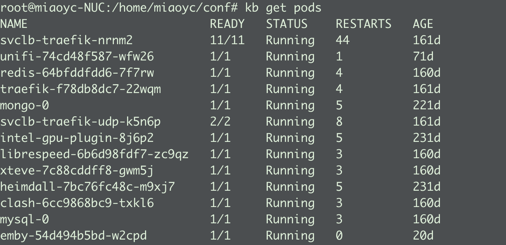
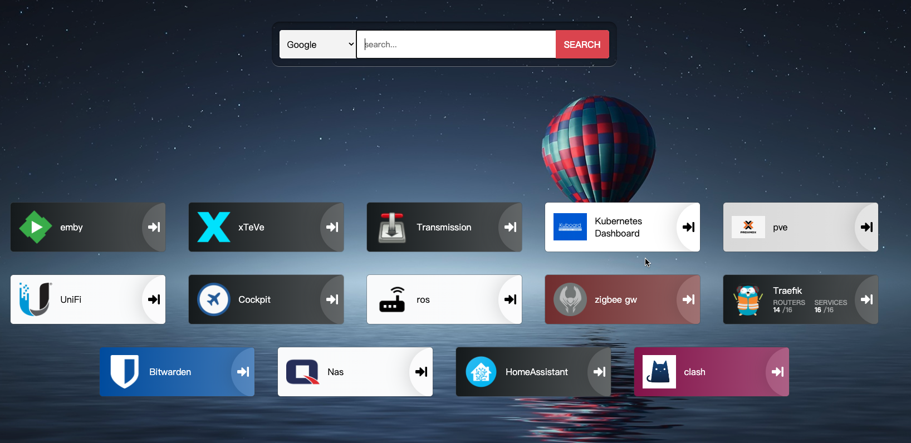

### 快照




#### install intel-gpu-plugin
```bash 
# https://github.com/intel/intel-device-plugins-for-kubernetes/tree/release-0.25/deployments/gpu_plugin
`kubectl apply -k https://github.com/intel/intel-device-plugins-for-kubernetes/deployments/gpu_plugin?ref=v0.25.1`
```

#### emby无法挂载nfs
```bash 
# 需要在宿主机安装nfs工具, 例如
apt-get install nfs-common -y
```

#### 安装helm
拷贝二进制文件即可，下载目录：https://github.com/helm/helm/releases/

#### helm配置源
1. helm repo add traefik https://helm.traefik.io/traefik
2. helm repo update

#### 启动traefik
1. kubectl apply -f pvc.yaml 
2. helm install traefik -f traefik.yaml traefik/traefik